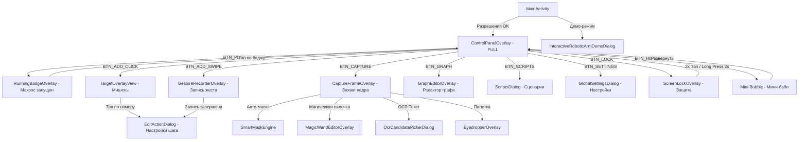

# УЛУЧШЕННАЯ КАРТА ВЗАИМОДЕЙСТВИЙ И АРХИТЕКТУРА ИНТЕРФЕЙСОВ AUTOTAP

## 📌 Оглавление и навигация
- [1. Глобальная матрица состояний и переходов (Mermaid Flowchart)](#1-глобальная-матрица-состояний-и-переходов)
- [2. Матрица контекстной видимости UI (Context-Aware Sanity Matrix)](#2-матрица-контекстной-видимости-ui)
- [3. Карта экранов с сквозными ID и привязкой к коду](#3-карта-экранов-с-сквозными-id-и-привязкой-к-коду)
  - [3.1 [SCR-MAIN] Главный экран (MainActivity)](#31-scr-main-главный-экран-mainactivity)
  - [3.2 [OVERLAY-CTRL] Плавающая панель управления (ControlPanelOverlay)](#32-overlay-ctrl-плавающая-панель-управления-controlpaneloverlay)
  - [3.3 [DLG-EDIT] Редактор шагов и жестов (EditActionDialog)](#33-dlg-edit-редактор-шагов-и-жестов-editactiondialog)
  - [3.4 [OVERLAY-GRAPH] Нодовый редактор графа (GraphEditorOverlay)](#34-overlay-graph-нодовый-редактор-графа-grapheditoroverlay)
  - [3.5 [DLG-SETT] Глобальные настройки (GlobalSettingsDialog)](#35-dlg-sett-глобальные-настройки-globalsettingsdialog)
  - [3.6 [DLG-SCRIPTS] Менеджер сценариев (ScriptsDialog)](#36-dlg-scripts-менеджер-сценариев-scriptsdialog)
  - [3.7 [OVERLAY-CAP] Захват кадра и ИИ-детекторы (CaptureFrameOverlay)](#37-overlay-cap-захват-кадра-и-ии-детекторы-captureframeoverlay)
  - [3.8 [DLG-DEMO] Интерактивное робо-демо (InteractiveRoboticArmDemoDialog)](#38-dlg-demo-интерактивное-робо-демо-interactiveroboticarmdemodialog)
  - [3.9 [OVERLAY-LOCK] Экран блокировки AMOLED (ScreenLockOverlay)](#39-overlay-lock-экран-блокировки-amoled-screenlockoverlay)
- [4. Обработка исключений, сбоев и граничных условий (Edge Cases)](#4-обработка-исключений-сбоев-и-граничных-условий)
- [5. Физика тача, тайминги и тактильный отклик (Touch & Physicality)](#5-физика-тача-тайминги-и-тактильный-отклик)

---

## 1. Глобальная матрица состояний и переходов

---

## 2. Матрица контекстной видимости UI

| Компонент / Настройка | Клик / Удержание | Свайп / Траектория | Шаблон (Vision) | OCR Текст | Цвет (HSV) |
| :--- | :---: | :---: | :---: | :---: | :---: |
| **Длительность / Пауза (мс)** | ✅ (Нажатие) | ✅ (Движение) | ❌ Скрыто | ❌ Скрыто | ❌ Скрыто |
| **Степперы `[-10]...[+10]`** | ✅ | ✅ | ❌ Скрыто | ❌ Скрыто | ❌ Скрыто |
| **Контрольные точки траектории** | ❌ | ✅ | ❌ Скрыто | ❌ Скрыто | ❌ Скрыто |
| **Зона поиска (ROI)** | ❌ Скрыто | ❌ Скрыто | ✅ | ✅ | ✅ |
| **Порог точности (%)** | ❌ Скрыто | ❌ Скрыто | ✅ (OpenCV ZNCC) | ✅ (ONNX) | ✅ (DeltaE) |
| **Таймаут поиска (мс)** | ❌ Скрыто | ❌ Скрыто | ✅ | ✅ | ✅ |
| **Ветвление УСПЕХ / СБОЙ** | ❌ Скрыто | ❌ Скрыто | ✅ | ✅ | ✅ |
| **Оповещение (Звук/Вибро)** | ❌ Скрыто | ❌ Скрыто | ✅ | ✅ | ✅ |

---

## 3. Карта экранов с сквозными ID и привязкой к коду

### 3.1 [SCR-MAIN] Главный экран (`MainActivity`)
- **Класс:** `com.example.autotap.presentation.main.MainActivity`
- **Функция:** Проверка системных прав и управление состоянием службы оверлея.
- **Элементы управления:**
  - `[CTRL-01] [BTN_TOGGLE_SERVICE]` — Кнопка запуска/остановки оверлея.
    - *Действие:* `AutoTapAccessibilityService.startOrStop()`.
    - *Ветвление:* Если разрешения отсутствуют -> перенаправление на `[SCR-MAIN-PERM]`.
  - `[CTRL-02] [BTN_OPEN_DEMO]` — Запуск демо-режима с роборукой.
    - *Действие:* Инициализация `InteractiveRoboticArmDemoDialog.show()`.
  - `[CTRL-03] [BTN_OPEN_SCRIPTS]` — Менеджер файлов сценариев.
    - *Действие:* Инициализация `ScriptsDialog.show()`.
  - `[CTRL-04] [BTN_OPEN_LOGS]` — Просмотр системного журнала.
    - *Действие:* Инициализация `LogViewerDialog.show()`.

### 3.2 [OVERLAY-CTRL] Плавающая панель управления (`ControlPanelOverlay`)
- **Класс:** `com.example.autotap.infrastructure.overlay.panel.ControlPanelOverlay`
- **Элементы управления:**
  - `[PANEL-01] [DRAG_HANDLE]` — Шапка перетаскивания (Touch target >= 48dp).
  - `[PANEL-02] [BTN_PLAY]` — Кнопка Пуск/Пауза (Зеленый #10B981 / Оранжевый #F59E0B).
    - *Действие:* Вызов `AutoTapOrchestrator.toggleExecution()`.
    - *Системный отклик:* Перевод UI в `RunningBadgeOverlay`.
  - `[PANEL-03] [BTN_ADD_CLICK]` — Кнопка добавления клика.
    - *Действие:* Генерация `TargetOverlayView` со случайным смещением.
  - `[PANEL-04] [BTN_ADD_SWIPE]` — Кнопка записи жеста.
    - *Действие:* Открытие `GestureRecorderOverlay`.
  - `[PANEL-05] [BTN_CAPTURE]` — Кнопка ИИ-калибровки.
    - *Действие:* Захват кадра через `MediaProjection` и открытие `CaptureFrameOverlay`.
  - `[PANEL-06] [BTN_GRAPH]` — Кнопка открывания нодового графа.
    - *Действие:* Переключение в `GraphEditorOverlay`.
  - `[PANEL-07] [BTN_LOCK]` — Кнопка защиты экрана.
    - *Действие:* Отображение `ScreenLockOverlay`.

---

## 4. Обработка исключений, сбоев и граничных условий (Edge Cases)

| Сбойная ситуация / Граничный случай | Реакция системы (System Behavior) | Восстановление и предотвращение |
| :--- | :--- | :--- |
| **Вылет или закрытие целевого приложения** | Детекция `AppProfileDetector`. Поиск останавливается при смене пакета. | Макрос автоматически переходит в `PAUSED` и выдает уведомление. |
| **Поворот экрана (Landscape / Portrait)** | `CoordinateNormalizer` пересчитывает координаты нод в относительные проценты (0.0–1.0). | Оверлеи перерисовываются без сброса текущего прогресса. |
| **Входящий звонок / Системный перехват** | `SafetyGovernor` фиксирует потерю фокуса специальным флагом. | Все активные жесты мгновенно отменяются (`ACTION_CANCEL`). |
| **Заполнение памяти при создании 100+ шаблонов** | `PixelBufferPool` принудительно очищает устаревшие Bitmap. | Автоматический ресайз и сжатие PNG масок до 16 KB Aligned. |
| **Отсутствие ветки `failureNextId` при ошибке поиска** | `MacroExecutionEngine` фиксирует остановку ветви. | Макрос корректно завершается со статусом `FINISHED_WITH_NOTICE`. |

---

## 5. Физика тача, тайминги и тактильный отклик

1. **Touch Target Standard:** Все интерактивные кнопки панели имеют минимальную визуальную область от 36dp и увеличенную кликабельную зону от **48dp** (Material Accessibility standard).
2. **Дебаунс тача:** Защита от случайных двойных нажатий с интервалом менее **350 мс**.
3. **Запись жестов 60–120 Гц:** Сжатие точек траектории с сохранением плавности сплайна (`PathCompressionEngine`).
4. **Тактильный отклик (Haptic Feedback):** Короткий виброотклик (20 мс) при добавлении мишени и длительный пульс (100 мс) при детекции ИИ-шаблона.

---
*Документ автоматически валидирован исполняемыми тестами 1AInspector.*
